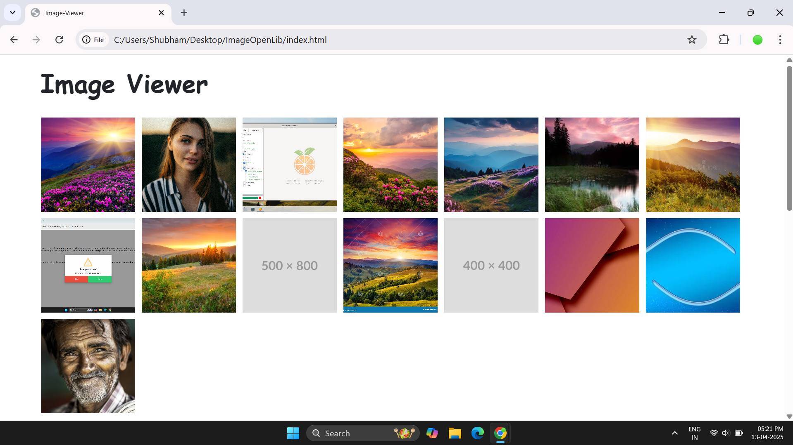
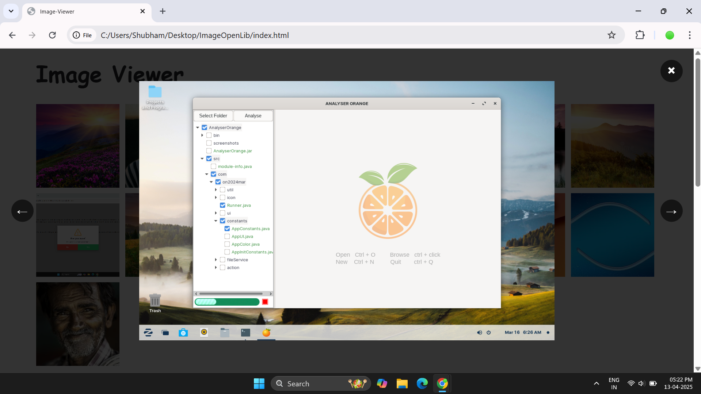
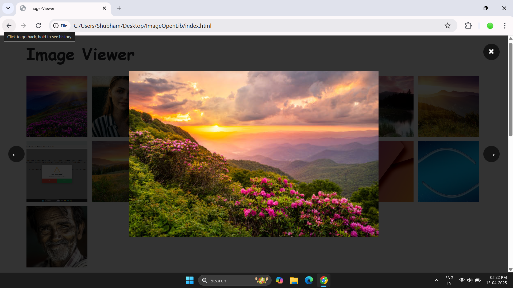
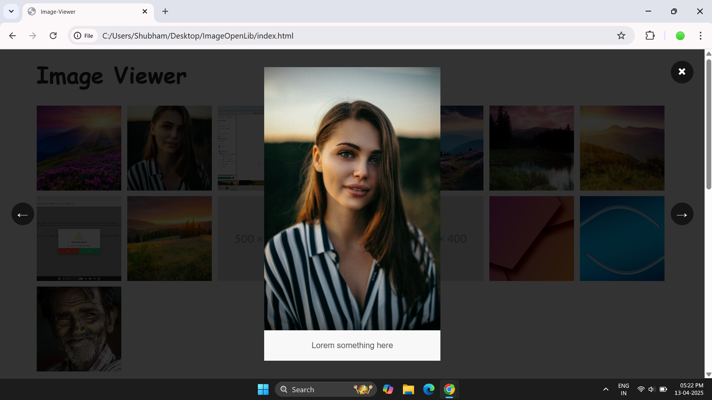

# 🌻 Image Viewer

Image viewer an image-preview library. EASY TO USE

## 🪶 Screenshots
<div style="display: flex;flex-direction: column; grid-gap: 10px;">
     <div style="display: flex; grid-gap: 10px;">
        
        
    </div>
</div>
<div style="display: flex;flex-direction: column; grid-gap: 10px;">
     <div style="display: flex; grid-gap: 10px;">
        
        
    </div>
</div>

## 🐊 Usage
Just add the style and script to your page and your are ready to start!

### Basic 
Add data attribute `data-image-preview="true"` to make your container support to preview image
```html
<div data-image-preview="true">
    
    
    
    
    
</div>
```

### With title
You can also add title to your images. use `data-title=""` attribute for writing image title

```html
<div data-image-preview="true">
    
</div>
```
## 🪴 Upcommings...

- Download button
- Image scroll on Left-Right keys
- Image scroll using drag on small devices
- Extra button to open Preview

## 🍕 Conclution
This project is currently under development. We will add more customizations in the near future. 
<br><br>
<div align="center">🍊 COMMENT FOR FAST UPDATE</div>
<br><br>
